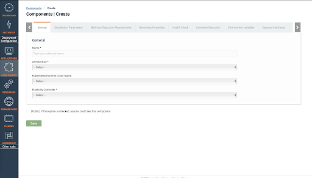
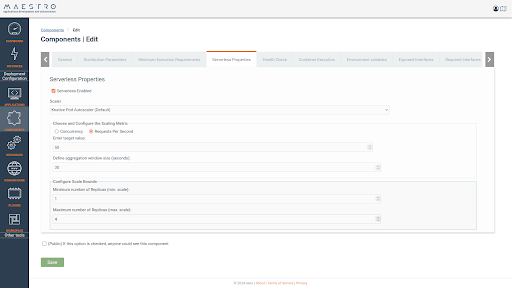
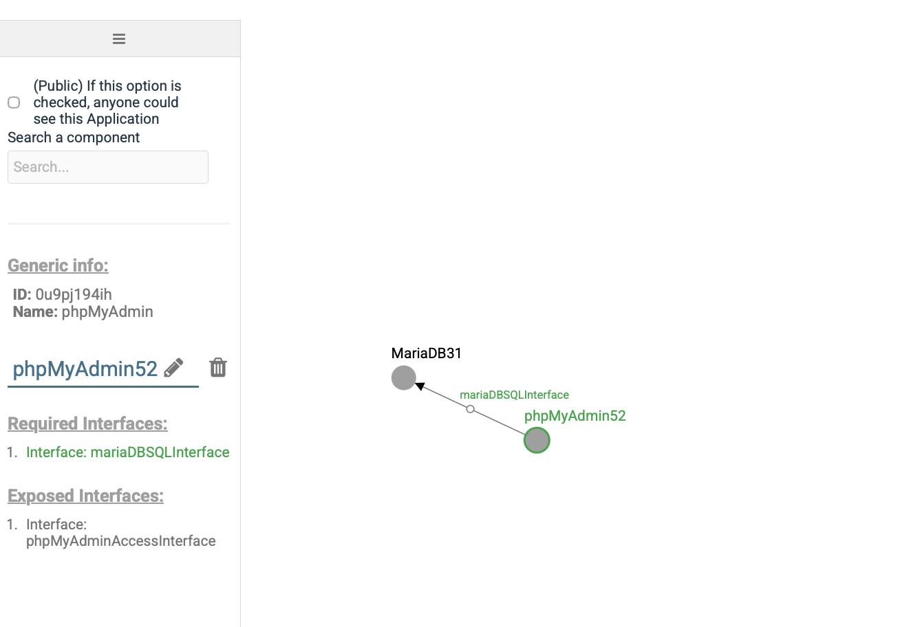
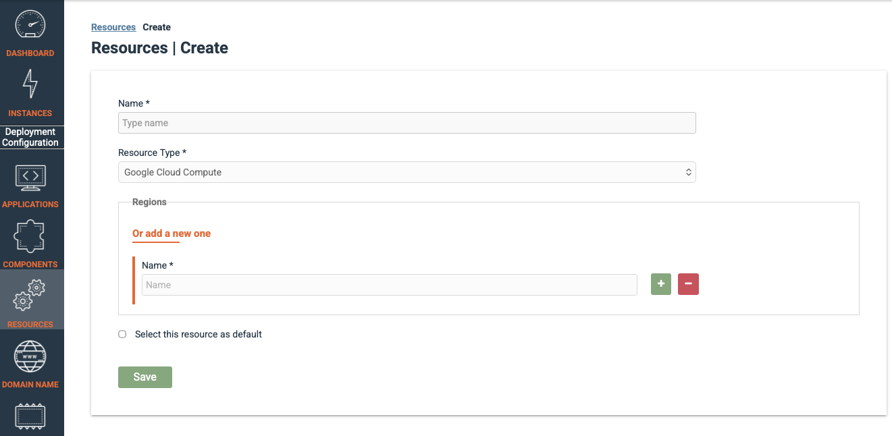
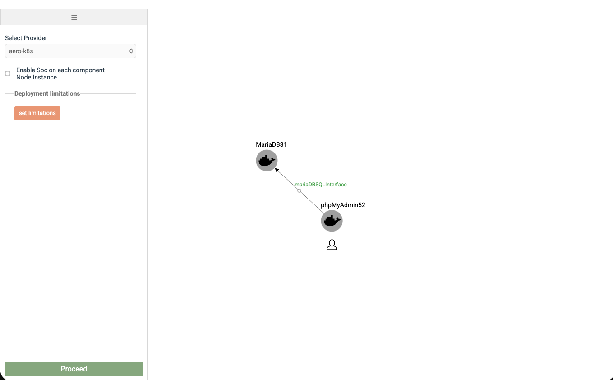
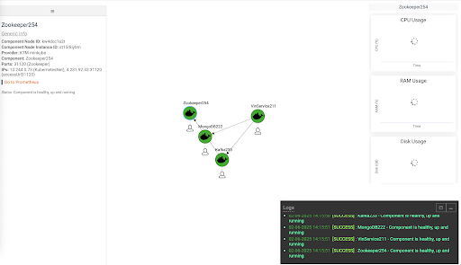

# Maestro Setup Guide

This repository contains the Docker Compose configuration and environment setup required to run **Maestro** with its UI, Backend, Database, PhpMyAdmin, and the Knative serverless controller.

## Prerequisites

Before starting, ensure you have:

- Docker (20.x or newer)
- Docker Compose (v2 recommended)
- Linux-based host

## Project Structure

```
.
├── figures/
├── docker-compose.yml
├── .env.example
├── init-volume.sh
└── README.md
```

## Docker Compose Configuration

The system consists of the following services:

- **UI Frontend**
- **UI Backend**
- **MySQL Database**
- **PhpMyAdmin**
- **Knative Serverless Controller**

> ⚠️ Most services use `network_mode: "host"`. Make sure ports do not conflict with other services on the host.

### Services Overview

| Service                       | Description                    |
| ----------------------------- | ------------------------------ |
| ui-frontend                   | Maestro UI frontend            |
| ui-backend                    | Maestro backend REST API       |
| database                      | MySQL database                 |
| phpmyadmin                    | Database management UI         |
| knative-serverless-controller | API for serverless deployments |

---

## Environment Variables

Based on on `.env.example`, create a `.env` file in the project root.

## Volume Initialization

Before starting the services, initialize the required directories on the host with `init_volume.sh`

```
chmod +x init_volume.sh
./init_volume.sh
```

## Starting Maestro

From the project root, run:

```
docker compose up -d
```

To check running containers:

```
docker compose ps
```

Accessing Maestro UI:

```
http://<SERVER_IP>:3000
```

## Walkthrough

1. Login with user: admin pass: !1q2w3e!

2. Create a _Component_.

<p align="start">
  
</p>

3. For serverless _Component_, you can edit the serverless properties tab.

<p align="start">
  
</p>

4. Create an _Application_.

<p align="start">
  
</p>

5. Create a _Resource_.

<p align="start">
  
</p>

6. Create an _Application Instance_ to deploy.

<p align="start">
  
</p>

7. Monitor deployed _Application Instance_.

<p align="start">
  
</p>

## Acknowledgements

This work has been funded by the European Union under Horizon Europe grant 101092850 (project AERO).
